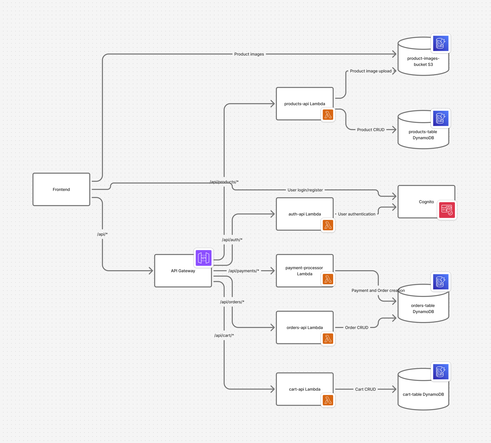

# EKart Store - LocalStack Tutorial Edition

A comprehensive e-commerce platform demonstrating multi-service AWS architectures using LocalStack. This tutorial showcases how to build and test complex cloud-native applications locally before deploying to production.

### why Ekart store?

Ekart store is a practical project for learning AWS and cloud-native development. It provides hands-on experience with real-world architectures, making it ideal for tutorials and experimentation. The ekart store can be further extended to include several features like product recommendation system, chatbot service, etc to utilize more tools and to experiment with several AWS services. Therefor this is a great project for a beginner to learn aws through Localstack.

## 🎯 Learning Objectives

This tutorial demonstrates:
1. Multi-service AWS integration with LocalStack
2. Event-driven architecture patterns
3. Serverless application development
4. Infrastructure as Code with CloudFormation
5. Modern frontend/backend development practices

## 🏗️ Architecture Overview

### Core AWS Services (Emulated)
- **API Gateway** - RESTful API endpoints
- **Lambda** - Serverless compute functions
- **DynamoDB** - NoSQL database
- **S3** - File storage for product images
- **Cognito** - Authentication and user management
- **CloudFormation** - Infrastructure provisioning

### Service Interactions
```

```

## 🚀 Quick Start

### Prerequisites
- Docker & Docker Compose
- Node.js 18+
- Python 3.9+
- AWS CLI configured for LocalStack

### One-Command Setup
```bash
# Clone and navigate to project
git clone <repository-url>
cd ekart-store

# Make scripts executable
chmod +x scripts/*.sh

# Setup everything automatically
./scripts/setup-local.sh
```

### Manual Setup Steps
```bash
# 1. Install dependencies
make install

# 2. Start LocalStack
docker-compose up -d localstack

# 3. Deploy infrastructure
make deploy-infra

# 4. Seed sample data
make seed-data

# 5. Start services
make start
```

## 🔧 Key Components Explained

### 1. Order Processing Workflow

**Problem Identified**: Orders weren't appearing in the orders list after successful payment due to incomplete integration between payment processing and order creation.

**Solution Implemented**:
- Enhanced payment processor Lambda to handle both payment intents and order creation
- Added proper linking between payment intents and orders in DynamoDB
- Updated frontend to collect shipping information and pass it during payment confirmation

**Workflow**:
1. User adds items to cart
2. Proceeds to checkout with shipping information
3. Frontend calls `/api/payments/create-payment-intent` to create payment
4. After payment confirmation, frontend calls `/api/payments/confirm-payment`
5. Payment processor creates order in DynamoDB and links it to payment intent
6. Orders are now visible in the `/orders` page

### 2. Data Models

#### Orders Table (`ekart-orders-dev`)
- Primary Key: `order_id`
- GSI: `buyer_id` and `seller_id` for efficient querying
- Fields: items, total_amount, status, payment_status, shipping_address

#### Products Table (`ekart-products-dev`)
- Primary Key: `product_id`
- GSI: `seller_id` and `category` for filtering
- Fields: title, description, price, stock_quantity, images

### 3. API Endpoints

#### Authentication
- `POST /api/auth/register` - Register new user
- `POST /api/auth/login` - Login and get JWT token

#### Products
- `GET /api/products` - List products
- `POST /api/products` - Create product (sellers)
- `GET /api/products/{id}` - Get product details
- `PUT /api/products/{id}` - Update product (sellers)

#### Cart
- `GET /api/cart` - Get user's cart
- `POST /api/cart/items` - Add item to cart
- `PUT /api/cart/items/{id}` - Update item quantity
- `DELETE /api/cart/items/{id}` - Remove item from cart

#### Payments
- `POST /api/payments/create-payment-intent` - Create payment intent
- `POST /api/payments/confirm-payment` - Confirm payment and create order

#### Orders
- `GET /api/orders` - List user's orders
- `GET /api/orders/{id}` - Get order details
- `PUT /api/orders/{id}/status` - Update order status (sellers)

### To run the project using python scripts
```bash
#cleanup the existing lambda functions (optinal)
python scripts\cleanup-serverless.py 

#Run this to deploy the dynamodb, s3 backets, IAM Role, API Gateway
python scripts\deploy-infrastructure.py

#Deploy Lambda functions
python scripts\deploy-serverless.py    

#Seed the sample products data
python scripts\seed.py      

#Test script. Tests involving extensions may not work for free version of localstack
python scripts\test-serverless-apis.py

#If frontend fails to work, run this script. This fixes api config to work with frontend.
python scripts\configure-frontend.py 
```

## 🛠️ Development Commands

```bash
# Show all available commands
make help

# Install all dependencies
make install

# Start all services
make start

# Stop all services
make stop

# Redeploy infrastructure
make deploy-infra

# Seed database with sample data
make seed-data

# Run tests
make test

# Clean up environment
make clean
```

## 🐛 Troubleshooting Common Issues

### Orders Not Showing After Payment
**Cause**: Previous implementation didn't link payment confirmation with order creation
**Fix**: Updated payment processor Lambda to create orders when payments are confirmed

### LocalStack Services Not Starting
```bash
# Check LocalStack health
curl http://localhost:4566/_localstack/health

# Restart LocalStack
make stop && make start
```

### Database Connection Issues
```bash
# Check DynamoDB tables
aws --endpoint-url=http://localhost:4566 dynamodb list-tables

# Check table contents
aws --endpoint-url=http://localhost:4566 dynamodb scan --table-name ekart-orders-dev
```

## 📊 Monitoring

### LocalStack Dashboard
- URL: http://localhost:4566/_localstack/cockpit
- Features: Resource browser, logs, metrics

### Service URLs
- **Frontend**: http://localhost:3000
- **Backend API**: http://localhost:8000
- **API Docs**: http://localhost:8000/api/docs
- **LocalStack**: http://localhost:4566

## 🤝 Contributing

This project serves as a comprehensive example for the LocalStack community, showcasing:
- Multi-service AWS integration patterns
- Serverless application best practices
- Real-world e-commerce workflows
- Event-driven architecture implementation

### Key Features Demonstrated
1. **Service Integration**: Complex workflows across multiple AWS services
2. **Database Operations**: DynamoDB with GSI queries and efficient data modeling
3. **Authentication**: Cognito user pools with JWT validation
4. **Infrastructure as Code**: CloudFormation deployment automation
5. **File Management**: S3 integration for product images

## 📝 License

This project is open source and available under the [MIT License](LICENSE).

---

**Built with ❤️ for the LocalStack community**