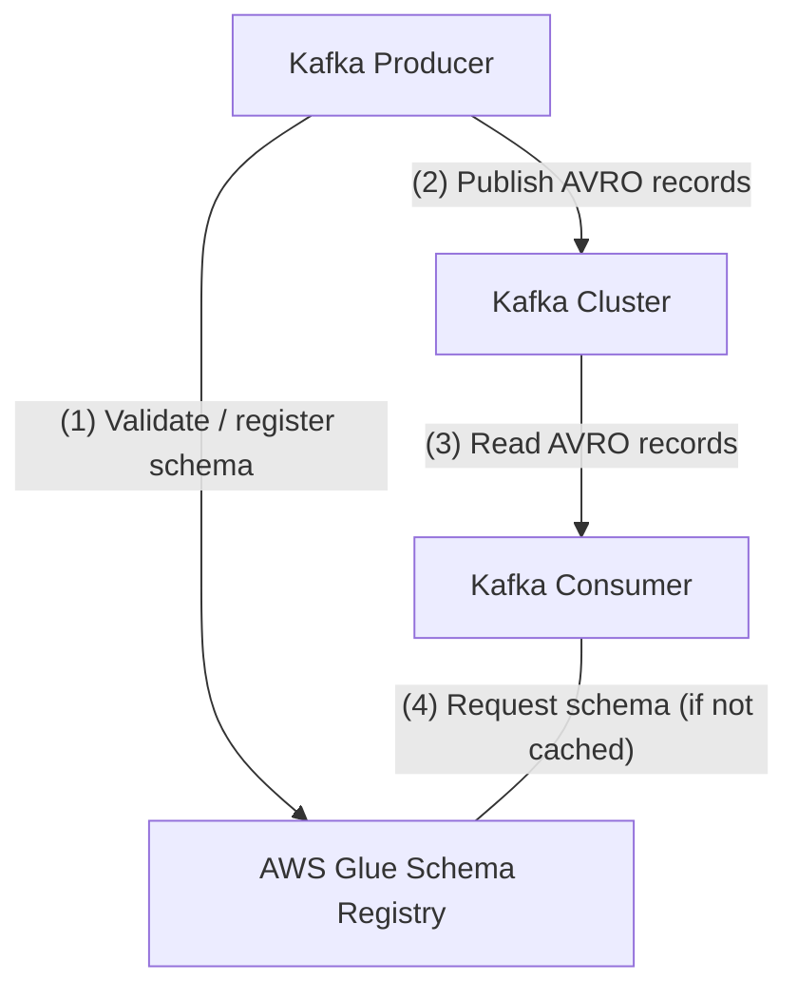

# LocalStack Demo: Schema Evolution with AWS Glue Schema Registry and AWS Managed Streaming for Kafka (MSK)

Simple demo application illustrating the use of AWS MSK, Glue Schema Registry, Glue ETL, and RDS.

## Prerequisites

* LocalStack
* Docker
* `make`
* [`awslocal`](https://github.com/localstack/awscli-local)
* Maven 3
* Java 11

## Installing
To install the dependencies:
```
make install
```
The install target only installs LocalStack and `awslocal`.
Please manually install Maven 3 and Java 11.

You can verify your installed versions by using Maven's version command:
```sh
$ mvn --version
Apache Maven 3.6.3
Maven home: /usr/share/maven
Java version: 11.0.15, vendor: Private Build, runtime: /usr/lib/jvm/java-11-openjdk-amd64
Default locale: en_US, platform encoding: UTF-8
OS name: "linux", version: "5.13.0-41-generic", arch: "amd64", family: "unix"
```

## App Details
This example shows how to use the AWS Glue Schema Registry in combination with AWS Managed Streaming for Kafka (MSK) in LocalStack.


The example first performs a very basic workflow:
- Create a new Kafka Cluster using AWS MSK. 
- Create a new AWS Glue Schema Registry.
- Create a new AWS Glue Schema with compatibility `BACKWARD`.
- Execute a Kafka Producer (`producer`) which sends 100 records compliant to the registered schema.
  - The producer will validate that its schema is already registered in the registry. (1)
  - The producer will compress the records using the schema and send them to the Kafka cluster. (2)
- Execute a Kafka Consumer (`consumer`) which waits for 100 records and processes them.
  - The consumer receives the records (3).
  - The consumer requests the schema from the registry if it's not already cached. (4)

Afterwards, a more advanced schema evolution showcase is performed:
- Execute a second Kafka Producer (`producer-2`) which automatically registers its new schema version.
  - This is successful, since the new version of the schema is `BACKWARD` compatible to the previous version.
- Use the AWS Glue Schema Registry to get a jsonpatch-diff of the two different schema versions.
- Execute the (previously already executed) Kafka Consumer (`consumer`), which now is incompatible to the new schema version.
  - The execution _fails_ with a specific error message indicating that the schema of the record is not compatible.
- Execute a third Kafka Producer (`producer-3`) which tries to register another version of the schema.
  - This time the registration _fails_, since the new version of the schema is _not_ `BACKWARD` compatible to the previous version.
- Finally, a second Kafka Consumer (`consumer-2`) is executed.
  - This consumer's schema is compatible to the schema which was used by `producer-2` and the execution is successful.

## Running
### Interactive Mode
The example allows being executed in "interactive mode".
After each step, you will be asked to enter any key to proceed with the execution of the next step.
```sh
make run-interactive
```

### Quiet Mode
If you just want to execute the complete example, execute the following command:
```sh
make run
```
The example will execute all commands without interruption.

## License

This sample code is available under the Apache 2.0 license.
