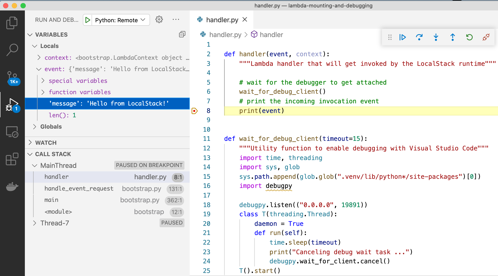

# LocalStack Demo: Lambda Code Mounting and Debugging

Simple demo application to illustrate debugging Python Lambdas locally.

## Prerequisites

* LocalStack
* Docker
* `make`
* [`awslocal`](https://github.com/localstack/awscli-local)

## Installing

To install the dependencies:
```
make install
```

## Starting Up

Make sure that LocalStack is started with the following configuration:
```
LOCALSTACK_API_KEY=... \
    LAMBDA_REMOTE_DOCKER=0 \
    LAMBDA_DOCKER_FLAGS='-p 19891:19891' \
    DEBUG=1 localstack start
```

Please note that `LAMBDA_REMOTE_DOCKER=0` needs to be configured in order to properly run the sample app (required for local Docker volume mounts).

The config option `LAMBDA_DOCKER_FLAGS='-p 19891:19891'` defines a Docker flag that exposes port `19891` for debugging the Lambda handler code that will run inside the container.

## Running the Sample

The project ships with a Visual Studio Code debug launch config (see `.vscode/launch.json`). This configuration can be used to attach to the code in the Lambda function while it is executing.

The following command used to first install the dependencies (e.g., `debugpy`), then deploy, and finally invoke the Lambda locally:

```
make run
```

### Attaching the VSCode Debugger

After the Lambda starts, you have about 15 seconds (timeout configurable in the Lambda handler!) to switch to Visual Studio Code and run the preconfigured remote debugger. Make sure to set a breakpoint in the Lambda handler code first, which can then later be inspected.

The screenshot below shows with the breakpoint selected, including the Lambda event message `'Hello from LocalStack!'`:



### Quick Dev Loop with Lambda Code Mounting

Note that, since the Lambda code is mounted from your local filesystem into the Lambda container (by means of `__local__` as special bucket name in `run.sh`), all changes are immediately reflected. For example, you could change the implementation of the handler as follows:
```
def handler(event, context):
    """Lambda handler that will get invoked by the LocalStack runtime"""

    # wait for the debugger to get attached
    wait_for_debug_client()
    # print the incoming invocation event
    print(event)

    # additional line added below:
    print("!! Additional log output !!")
```
... and then upon next invocation of the Lambda, the additional print output will immediately appear in the Lambda logs. This allows for a quick dev/debug loop, without the need to redeploy the Lambda after the handler is changed!

## Next Steps

More examples and tooling support for local Lambda debugging (including support for other IDEs like PyCharm, IntelliJ, etc.) is coming soon - stay tuned!

## License

The code in this sample is available under the Apache 2.0 license.
